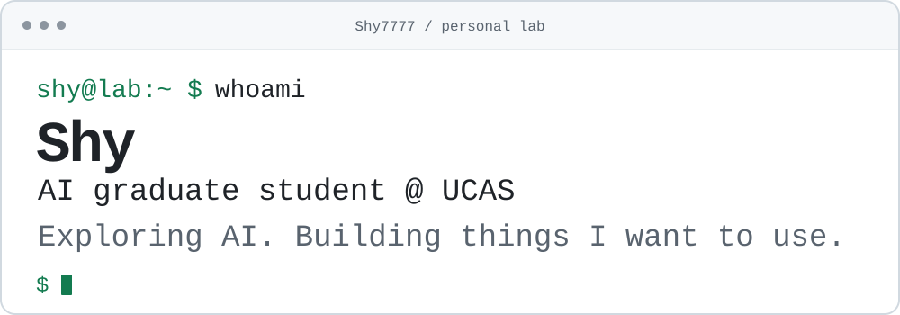

<picture>
  <source media="(prefers-color-scheme: dark)" srcset="./assets/terminal-dark.svg">
  <source media="(prefers-color-scheme: light)" srcset="./assets/terminal-light.svg">
  
</picture>

### `$ ls ./selected-projects`

**[valshop-daily ↗](https://github.com/Shy7777/valshop-daily)** · `Python` `CLI` `Automation`

无畏契约每日商店查询、图片生成与 Hermes 定时推送。把每天重复做的小事，变成一个命令。

**[hermes-web-ui ↗](https://github.com/Shy7777/hermes-web-ui)** · `TypeScript` `Customized fork`

基于 [Hermes Studio](https://github.com/EKKOLearnAI/hermes-studio) 的个人改动：支持从历史会话恢复对话，并移除广告。

### `$ cat ./interests.md`

- **AI agents** — 探索 Agent 如何使用工具、管理上下文并完成任务。
- **Everyday automation** — 把自己的实际需求做成可以反复使用的小工具。
- **Open source** — 阅读源码、动手修改，再把有用的改动分享出来。

### `$ cat ./contributions.svg`

<picture>
  <source media="(prefers-color-scheme: dark)" srcset="https://raw.githubusercontent.com/Shy7777/Shy7777/output/github-snake-dark.svg">
  <source media="(prefers-color-scheme: light)" srcset="https://raw.githubusercontent.com/Shy7777/Shy7777/output/github-snake.svg">
  
</picture>

<code>$ whoami --more</code>

I'm **Sun Haoyuan (Shy)**, an AI graduate student at the **University of Chinese Academy of Sciences**.

I enjoy understanding how things work, building tools for everyday problems, and sharing what I learn along the way.

---

<samp>~/ideas → ~/code</samp>

